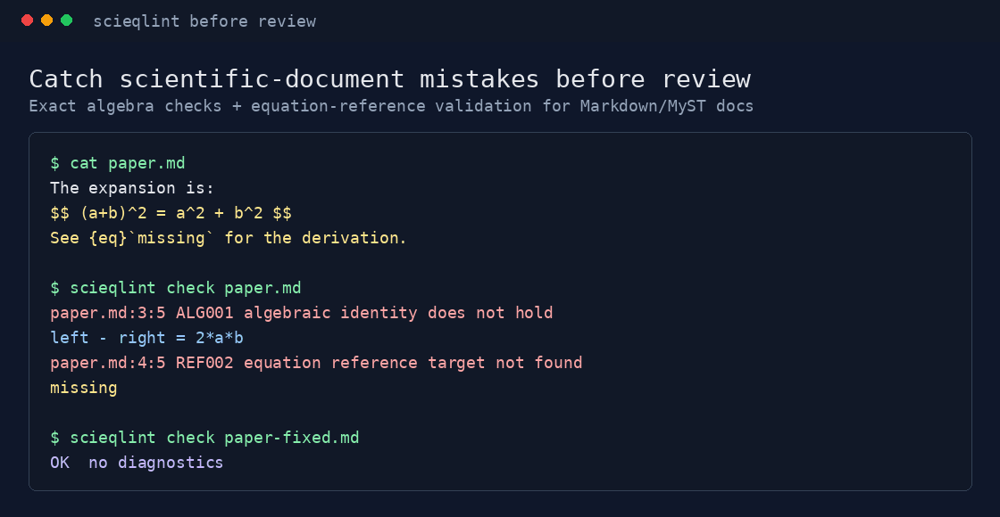

<div align="center">

# SciEqLint

**Deterministic linting for scientific Markdown, MyST, LaTeX, and notebooks.**

Catch exact scalar algebra mistakes and broken equation references before review.

[](https://pypi.org/project/scieqlint/)
[](https://pypi.org/project/scieqlint/)
[](https://github.com/Kuhai9801/scieqlint/actions/workflows/ci.yml)
[](https://app.codecov.io/github/Kuhai9801/scieqlint)
[](https://github.com/Kuhai9801/scieqlint/actions/workflows/docs.yml)
[](https://github.com/Kuhai9801/scieqlint/actions/workflows/codeql.yml)
[](https://scorecard.dev/viewer/?uri=github.com/Kuhai9801/scieqlint)
[](LICENSE)



</div>

## Why SciEqLint

General prose and Markdown linters catch style issues. SciEqLint checks the
scientific-document failure modes that are easy to miss in review:

| Check | Example | Diagnostic |
| --- | --- | --- |
| Exact scalar algebra | `(a+b)^2 = a^2 + b^2` | `ALG001 algebraic identity does not hold` |
| Equation references | ``See {eq}`missing`.`` | `REF002 equation reference target not found` |

SciEqLint is deterministic. Given the same files, config, and version, it emits
the same diagnostics in the same order. Supported math is checked exactly;
unsupported math is reported as unknown or skipped instead of guessed.

## Quick Start

```bash
python -m pip install scieqlint
scieqlint check .
```

Common commands:

```bash
scieqlint check .
scieqlint check README.md
scieqlint check examples/bad/famous_bad.md --format github
scieqlint graph "docs/**/*.md" --output scieqlint-graph.json
scieqlint demo
```

## Supported files

SciEqLint checks `.md`, `.markdown`, `.tex`, and `.ipynb` documents. It supports
Markdown/MyST display math, supported LaTeX containers, notebook Markdown cells,
labels and references, simple scalar algebra, text output, deterministic JSON output,
SARIF, and JSON Schema validation. See `docs/limitations.md` for the exact
scanner and grammar coverage.

Current release target: v1.0.0.

## Integrations

Use GitHub annotations for pull requests:

```yaml
- name: Check equations
  run: scieqlint check "docs/**/*.md" --format github
```

Upload SARIF for code scanning:

```yaml
permissions:
  contents: read
  security-events: write

steps:
  - uses: actions/checkout@v6
  - uses: Kuhai9801/scieqlint@v1.0.0
    with:
      args: check "docs/**/*.md" --format sarif --output scieqlint.sarif
  - uses: github/codeql-action/upload-sarif@v4
    with:
      sarif_file: scieqlint.sarif
      category: scieqlint-docs
```

## Local Development

```bash
python -m pip install -e '.[dev]'
scieqlint --help
scieqlint check .
python -m pytest
```

## For contributors

Start with these files:

- `SPEC.md` for the product and engineering contract.
- `CONTRIBUTING.md` for the local workflow.
- `GOOD_FIRST_ISSUES.md` for scoped starter tasks.
- `ROADMAP.md` for release order and cut rules.
- `docs/contributing/` for deeper guidance.

Keep PRs small and test the behavior they change.

## License

MIT. See `LICENSE`.
